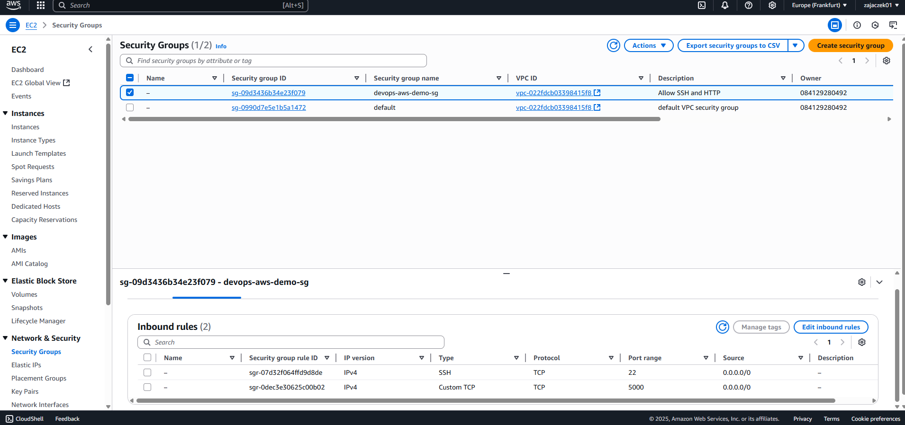
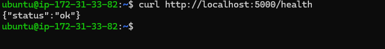

# DevOps AWS Demo

[🇵🇱 Polski](README.pl.md) | 🇬🇧 English

A demonstration DevOps project: automatic deployment of a Python (Flask) application to AWS Cloud with CI/CD, Infrastructure as Code (Terraform), and (optionally) monitoring (Prometheus + Grafana).

---

## Table of Contents
- [Project Overview](#project-overview)
- [Architecture](#architecture)
- [Tech Stack](#tech-stack)
- [Getting Started](#getting-started)
- [DevOps Automation](#devops-automation)
- [Next Steps](#next-steps)
- [Screenshots](#screenshots)
- [Author](#author)

---

## Project Overview
This project demonstrates a complete DevOps workflow: from application code, through automated testing, Docker image build and publishing, infrastructure provisioning in AWS (Terraform), to deployment and running the app in the cloud. Perfect for a DevOps portfolio!

## Architecture
- Python (Flask) app running in a Docker container
- CI/CD: GitHub Actions (tests, build, push to Docker Hub)
- Infrastructure as Code: Terraform (VPC, EC2, Security Group, SSH key)
- Deployment: AWS EC2 (Ubuntu, Docker)
- Monitoring: (optional, for future) Prometheus + Grafana


## Tech Stack
- Python 3.x, Flask
- Docker
- GitHub Actions
- Terraform
- AWS (EC2, VPC, IAM)
- (Optional: Prometheus, Grafana)

## Getting Started

### 1. Clone the repository
```sh
git clone https://github.com/zajaczek01/devops-aws-demo.git
cd devops-aws-demo
```

### 2. Run locally with Docker
```sh
cd docker
docker-compose up --build
```
The app will be available at [http://localhost:5000/health](http://localhost:5000/health)

### 3. CI/CD Pipeline
- Tests and Docker image build are triggered automatically by GitHub Actions
- Docker image is published to Docker Hub: [zajaczek01/devops-aws-demo](https://hub.docker.com/r/zajaczek01/devops-aws-demo)

### 4. AWS Infrastructure Provisioning (Terraform)
```sh
cd terraform
terraform init
terraform apply
```
- Creates EC2, Security Group, SSH key
- After completion, the public IP address of the EC2 instance will be displayed

### 5. Deploy the app on EC2
SSH into the EC2 instance:
```sh
ssh -i devops-aws-demo-key ubuntu@PUBLIC_IP_ADDRESS
```
Install Docker and run the app:
```sh
sudo apt update && sudo apt install -y docker.io
sudo docker run -d -p 5000:5000 zajaczek01/devops-aws-demo:latest
```
The app will be available at: `http://PUBLIC_IP_ADDRESS:5000/health`

## REST API – Task Manager

The application exposes a simple REST API for managing tasks (ToDo):

### Endpoints
- `GET /tasks` – get all tasks
- `POST /tasks` – add a new task (JSON: `{ "title": "Something to do" }`)
- `DELETE /tasks/<id>` – delete a task by id

### Example usage (with curl):

**Add a new task:**
```sh
curl -X POST http://localhost:5000/tasks -H "Content-Type: application/json" -d '{"title": "Buy milk"}'
```

**Get all tasks:**
```sh
curl http://localhost:5000/tasks
```

**Delete a task:**
```sh
curl -X DELETE http://localhost:5000/tasks/1
```

### Task model
Each task has the following fields:
- `id` (integer): unique identifier
- `title` (string): task description
- `done` (boolean): completion status

### Example response from `GET /tasks`
```json
[
  {"id": 1, "title": "Buy milk", "done": false},
  {"id": 2, "title": "Write DevOps project documentation", "done": false},
  {"id": 3, "title": "Deploy app to AWS EC2", "done": true}
]
```

---

## DevOps Automation
- Full CI/CD pipeline (tests, build, push to Docker Hub)
- Infrastructure as Code (Terraform)
- Application deployment in AWS Cloud
- Ready for extension: monitoring, auto-deployment, Ansible, Prometheus, Grafana

---

## Next Steps
- [ ] Automate deployment on EC2 (user-data, Ansible)
- [ ] Monitoring (Prometheus, Grafana, CloudWatch)
- [ ] Complete documentation and diagrams
- [ ] Security (secrets, port restrictions)

---

## Screenshots

Below are example screenshots from the project and DevOps environment:

- **EC2 Instances in AWS:**
  

- **Security Group with open port 5000:**
  

- **Result of `docker ps` on EC2:**
  

- **Result of `curl http://localhost:5000/health` on EC2:**
  

- **App in the browser:**
  

- **GitHub Actions workflow (green check):**
  

- **Docker Hub image:**
  

- **Architecture diagram (draw.io):**
  

---


## Quick deployment on EC2

To update and run the latest version of the app on your EC2 server, use the provided script:

```sh
cd scripts
chmod +x deploy.sh
./deploy.sh
```

This script will:
- Stop and remove the old container (if exists)
- Pull the latest image from Docker Hub
- Start a new container on port 5000 

---

## Author
zajaczek01 

