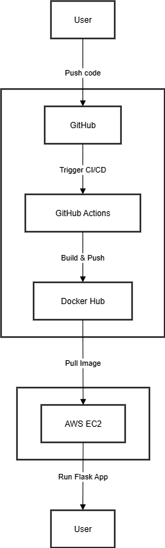
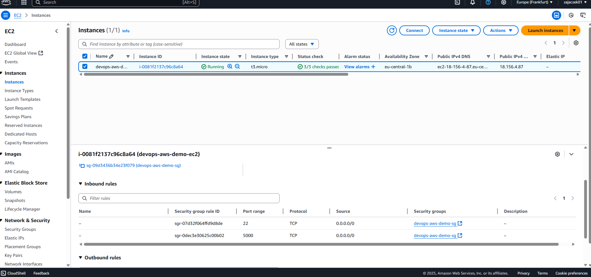
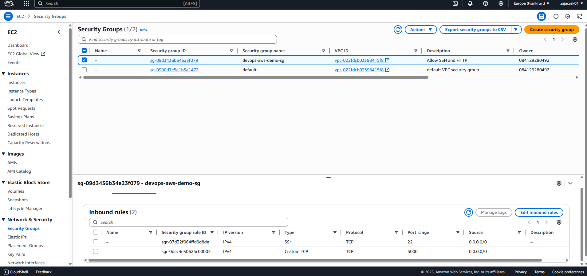
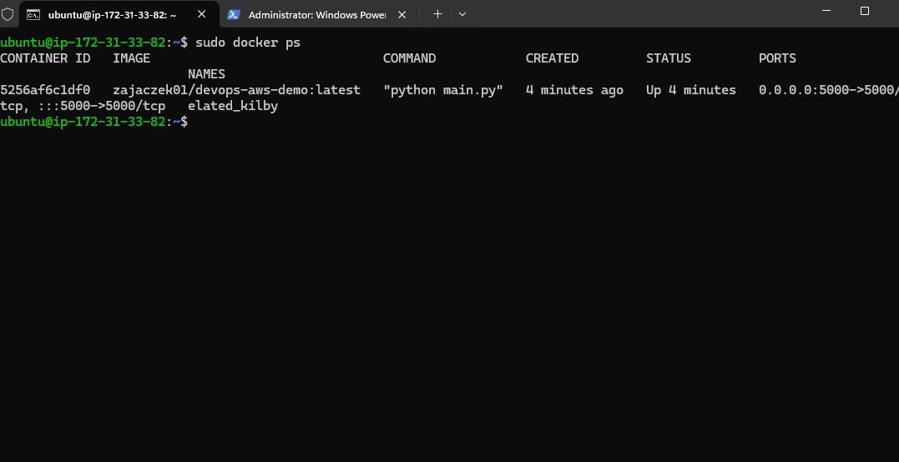
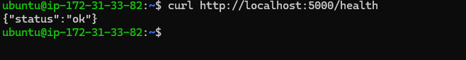
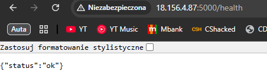
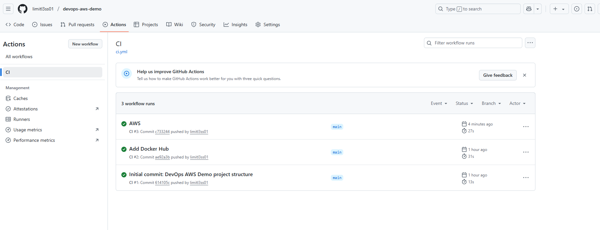
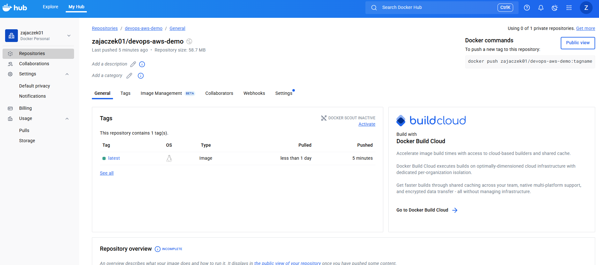

# DevOps AWS Demo

🇬🇧 English version [here](README.md)

To repozytorium to mój własny projekt, w którym chciałem połączyć praktyczną naukę DevOps, automatyzację, chmurę AWS i konteneryzację. Aplikacja to proste REST API w Pythonie (Flask) do zarządzania zadaniami, które automatycznie wdrażam na EC2 przez CI/CD.

---

## Spis treści
- [Opis projektu](#opis-projektu)
- [Architektura](#architektura)
- [Stack technologiczny](#stack-technologiczny)
- [Instrukcja uruchomienia](#instrukcja-uruchomienia)
- [REST API – Task Manager](#rest-api--task-manager)
- [Automatyczny deployment do chmury (CI/CD na EC2)](#automatyczny-deployment-do-chmury-cicd-na-ec2)
- [Szybki deployment na EC2](#szybki-deployment-na-ec2)
- [Dalsze kroki](#dalsze-kroki)
- [Screeny](#screeny)
- [Autor](#autor)

---

## Opis projektu
Chciałem zbudować coś, co łączy kodowanie, konteneryzację, Infrastructure as Code i automatyzację w chmurze. Sercem projektu jest API Flask do zarządzania zadaniami, ale najważniejsza jest tu automatyzacja i pipeline deploymentu.

## Architektura
- Aplikacja Flask w kontenerze Docker
- CI/CD: GitHub Actions (testy, build, push do Docker Hub, deployment na EC2)
- Infrastructure as Code: Terraform (VPC, EC2, Security Group, klucz SSH)
- Deployment: AWS EC2 (Ubuntu, Docker)
- (Opcjonalnie) Monitoring: Prometheus + Grafana



## Stack technologiczny
- Python 3.x, Flask
- Docker
- GitHub Actions
- Terraform
- AWS (EC2, VPC, IAM)
- (Opcjonalnie: Prometheus, Grafana)

## Instrukcja uruchomienia

### 1. Klonowanie repozytorium
```sh
git clone https://github.com/zajaczek01/devops-aws-demo.git
cd devops-aws-demo
```

### 2. Uruchomienie lokalnie w Dockerze
```sh
cd docker
docker-compose up --build
```
Aplikacja będzie dostępna pod adresem [http://localhost:5000/health](http://localhost:5000/health)

### 3. Pipeline CI/CD
- Testy i budowanie obrazu Dockera uruchamiane są automatycznie przez GitHub Actions
- Obraz Dockera trafia do Docker Hub: [zajaczek01/devops-aws-demo](https://hub.docker.com/r/zajaczek01/devops-aws-demo)

### 4. Provisioning infrastruktury AWS (Terraform)
```sh
cd terraform
terraform init
terraform apply
```
- Tworzy EC2, Security Group, klucz SSH
- Po zakończeniu zobaczysz publiczny adres IP EC2

### 5. Wdrożenie aplikacji na EC2
Zaloguj się na EC2:
```sh
ssh -i devops-aws-demo-key ubuntu@PUBLICZNY_ADRES_IP
```
Zainstaluj Dockera i uruchom aplikację:
```sh
sudo apt update && sudo apt install -y docker.io
sudo docker run -d -p 5000:5000 zajaczek01/devops-aws-demo:latest
```
Aplikacja będzie dostępna pod adresem: `http://PUBLICZNY_ADRES_IP:5000/health`

---

## REST API – Task Manager

Aplikacja udostępnia proste REST API do zarządzania zadaniami (ToDo):

### Endpointy
- `GET /tasks` – pobierz wszystkie zadania
- `POST /tasks` – dodaj nowe zadanie (JSON: `{ "title": "Coś do zrobienia" }`)
- `DELETE /tasks/<id>` – usuń zadanie o danym id

### Przykłady użycia (curl):

**Dodaj nowe zadanie:**
```sh
curl -X POST http://localhost:5000/tasks -H "Content-Type: application/json" -d '{"title": "Kupić mleko"}'
```

**Pobierz wszystkie zadania:**
```sh
curl http://localhost:5000/tasks
```

**Usuń zadanie:**
```sh
curl -X DELETE http://localhost:5000/tasks/1
```

### Model zadania
Każde zadanie posiada następujące pola:
- `id` (liczba całkowita): unikalny identyfikator
- `title` (tekst): opis zadania
- `done` (prawda/fałsz): status wykonania

### Przykładowa odpowiedź z `GET /tasks`
```json
[
  {"id": 1, "title": "Buy milk", "done": false},
  {"id": 2, "title": "Write DevOps project documentation", "done": false},
  {"id": 3, "title": "Deploy app to AWS EC2", "done": true}
]
```

---

## Automatyczny deployment do chmury (CI/CD na EC2)

W repozytorium jest workflow GitHub Actions (`.github/workflows/deploy.yml`), który automatyzuje wdrożenie na AWS EC2:

- Przy każdym pushu do gałęzi `main`:
  - Uruchamiane są testy i budowany jest obraz Dockera
  - Obraz trafia do Docker Hub
  - Następuje połączenie przez SSH z EC2 i uruchomienie skryptu deploymentu (`scripts/deploy.sh`)

**Dlaczego tak?**
Chciałem, żeby każda zmiana w kodzie była automatycznie testowana, budowana i wdrażana w chmurze – bez ręcznych kroków. Tak wygląda nowoczesna automatyzacja DevOps.

Proces deploymentu możesz śledzić w zakładce **Actions** na GitHubie.

---

## Szybki deployment na EC2

Aby zaktualizować i uruchomić najnowszą wersję aplikacji na serwerze EC2, użyj dołączonego skryptu:

```sh
cd scripts
chmod +x deploy.sh
./deploy.sh
```

Skrypt automatycznie:
- Zatrzymuje i usuwa stary kontener (jeśli istnieje)
- Pobiera najnowszy obraz z Docker Hub
- Uruchamia nowy kontener na porcie 5000

---

## Dalsze kroki
- [ ] Monitoring (Prometheus, Grafana, CloudWatch)
- [ ] Bardziej zaawansowana infrastruktura (S3, RDS, Load Balancer)
- [ ] Bezpieczeństwo (sekrety, HTTPS, ograniczenie portów)
- [ ] Rozbudowa API i testów

---

## Screeny

Poniżej kilka screenów z projektu i środowiska DevOps:

- **Instancje EC2 w AWS:**
  

- **Security Group z otwartym portem 5000:**
  

- **Wynik polecenia `docker ps` na EC2:**
  

- **Wynik polecenia `curl http://localhost:5000/health` na EC2:**
  

- **Widok aplikacji w przeglądarce:**
  

- **Workflow GitHub Actions (zielony check):**
  

- **Obraz na Docker Hub:**
  

- **Diagram architektury (draw.io):**
  

---

## Autor
zajaczek01 