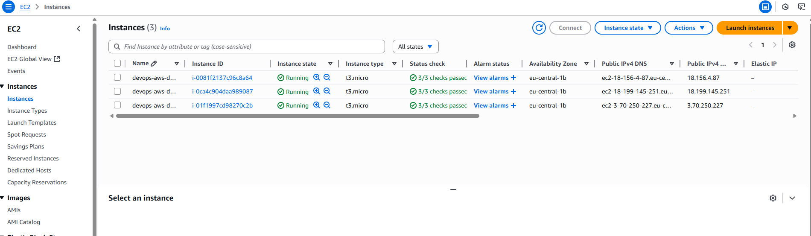

# DevOps AWS Demo

🇬🇧 English version [here](README.md)

To repozytorium to mój własny projekt, w którym chciałem połączyć praktyczną naukę DevOps, automatyzację, chmurę AWS i konteneryzację. Aplikacja to proste REST API w Pythonie (Flask) do zarządzania zadaniami, które automatycznie wdrażam na EC2 przez CI/CD.

---

## Spis treści
- [Opis projektu](#opis-projektu)
- [Architektura](#architektura)
- [Stack technologiczny](#stack-technologiczny)
- [Instrukcja uruchomienia](#instrukcja-uruchomienia)
- [REST API – Task Manager](#rest-api--task-manager)
- [Automatyczny deployment do chmury (CI/CD na EC2)](#automatyczny-deployment-do-chmury-cicd-na-ec2)
- [Szybki deployment na EC2](#szybki-deployment-na-ec2)
- [Dalsze kroki](#dalsze-kroki)
- [Screeny](#screeny)
- [Autor](#autor)

---

## Opis projektu
Chciałem zbudować coś, co łączy kodowanie, konteneryzację, Infrastructure as Code i automatyzację w chmurze. Sercem projektu jest API Flask do zarządzania zadaniami, ale najważniejsza jest tu automatyzacja i pipeline deploymentu.

## Architektura
- Aplikacja Flask w kontenerze Docker
- CI/CD: GitHub Actions (testy, build, push do Docker Hub, deployment na EC2)
- Infrastructure as Code: Terraform (VPC, EC2, Security Group, klucz SSH)
- Deployment: AWS EC2 (Ubuntu, Docker)
- (Opcjonalnie) Monitoring: Prometheus + Grafana


## Stack technologiczny
- Python 3.x, Flask
- Docker
- GitHub Actions
- Terraform
- AWS (EC2, VPC, IAM)
- (Opcjonalnie: Prometheus, Grafana)

## Instrukcja uruchomienia

### 1. Klonowanie repozytorium
```sh
git clone https://github.com/zajaczek01/devops-aws-demo.git
cd devops-aws-demo
```

### 2. Uruchomienie lokalnie w Dockerze
```sh
cd docker
docker-compose up --build
```
Aplikacja będzie dostępna pod adresem [http://localhost:5000/health](http://localhost:5000/health)

### 3. Pipeline CI/CD
- Testy i budowanie obrazu Dockera uruchamiane są automatycznie przez GitHub Actions
- Obraz Dockera trafia do Docker Hub: [zajaczek01/devops-aws-demo](https://hub.docker.com/r/zajaczek01/devops-aws-demo)

### 4. Provisioning infrastruktury AWS (Terraform)
```sh
cd terraform
terraform init
terraform apply
```
- Tworzy EC2, Security Group, klucz SSH
- Po zakończeniu zobaczysz publiczny adres IP EC2

### 5. Wdrożenie aplikacji na EC2
Zaloguj się na EC2:
```sh
ssh -i devops-aws-demo-key ubuntu@PUBLICZNY_ADRES_IP
```
Zainstaluj Dockera i uruchom aplikację:
```sh
sudo apt update && sudo apt install -y docker.io
sudo docker run -d -p 5000:5000 zajaczek01/devops-aws-demo:latest
```
Aplikacja będzie dostępna pod adresem: `http://PUBLICZNY_ADRES_IP:5000/health`

---

## REST API – Task Manager

Aplikacja udostępnia proste REST API do zarządzania zadaniami (ToDo):

### Endpointy
- `GET /tasks` – pobierz wszystkie zadania
- `POST /tasks` – dodaj nowe zadanie (JSON: `{ "title": "Coś do zrobienia" }`)
- `DELETE /tasks/<id>` – usuń zadanie o danym id

### Przykłady użycia (curl):

**Dodaj nowe zadanie:**
```sh
curl -X POST http://localhost:5000/tasks -H "Content-Type: application/json" -d '{"title": "Kupić mleko"}'
```

**Pobierz wszystkie zadania:**
```sh
curl http://localhost:5000/tasks
```

**Usuń zadanie:**
```sh
curl -X DELETE http://localhost:5000/tasks/1
```

### Model zadania
Każde zadanie posiada następujące pola:
- `id` (liczba całkowita): unikalny identyfikator
- `title` (tekst): opis zadania
- `done` (prawda/fałsz): status wykonania

### Przykładowa odpowiedź z `GET /tasks`
```json
[
  {"id": 1, "title": "Buy milk", "done": false},
  {"id": 2, "title": "Write DevOps project documentation", "done": false},
  {"id": 3, "title": "Deploy app to AWS EC2", "done": true}
]
```

---

## Automatyczny deployment do chmury (CI/CD na EC2)

W repozytorium jest workflow GitHub Actions (`.github/workflows/deploy.yml`), który automatyzuje wdrożenie na AWS EC2:

- Przy każdym pushu do gałęzi `main`:
  - Uruchamiane są testy i budowany jest obraz Dockera
  - Obraz trafia do Docker Hub
  - Następuje połączenie przez SSH z EC2 i uruchomienie skryptu deploymentu (`scripts/deploy.sh`)

**Dlaczego tak?**
Chciałem, żeby każda zmiana w kodzie była automatycznie testowana, budowana i wdrażana w chmurze – bez ręcznych kroków. Tak wygląda nowoczesna automatyzacja DevOps.

Proces deploymentu możesz śledzić w zakładce **Actions** na GitHubie.

---

## Szybki deployment na EC2

Aby zaktualizować i uruchomić najnowszą wersję aplikacji na serwerze EC2, użyj dołączonego skryptu:

```sh
cd scripts
chmod +x deploy.sh
./deploy.sh
```

Skrypt automatycznie:
- Zatrzymuje i usuwa stary kontener (jeśli istnieje)
- Pobiera najnowszy obraz z Docker Hub
- Uruchamia nowy kontener na porcie 5000

---

## Dalsze kroki
- [ ] Monitoring (Prometheus, Grafana, CloudWatch)
- [ ] Bardziej zaawansowana infrastruktura (S3, RDS, Load Balancer)
- [ ] Bezpieczeństwo (sekrety, HTTPS, ograniczenie portów)
- [ ] Rozbudowa API i testów

---

## Screeny

Poniżej kilka screenów z projektu i środowiska DevOps:

- **Instancje EC2 w AWS:**
  

- **Security Group z otwartym portem 5000:**
  

- **Diagram architektury (draw.io):**
  

---


## Praktyki bezpieczeństwa
- **Prywatne klucze SSH nigdy nie są przechowywane w repozytorium.** Wszystkie wrażliwe dane są zarządzane przez GitHub Secrets lub poza systemem kontroli wersji.
- **Klucze publiczne** są wykorzystywane do provisioningu dostępu do EC2 i mogą być bezpiecznie wersjonowane.
- **Remote state Terraform** trzymany jest w S3 z blokadą w DynamoDB, co zapobiega konfliktom i zapewnia bezpieczeństwo pracy zespołowej.
- **Zarządzanie sekretami** odbywa się przez zaszyfrowane sekrety GitHub Actions.

## Zarządzanie środowiskami
- Każde środowisko (staging, production) ma własną, odseparowaną infrastrukturę, state i pipeline deploymentu.
- Zmienne środowiskowe są zarządzane przez osobne pliki `terraform.tfvars` i konfiguracje backendu.
- Dzięki temu można bezpiecznie testować na staging przed wdrożeniem na produkcję.

## Strategia rozwoju projektu
- Projekt zaczął się jako proste API Flask, a rozwinął się w pełną prezentację automatyzacji DevOps.
- Infrastruktura od początku zarządzana jako kod, co umożliwia łatwe skalowanie i powtarzalność.
- Pipeline CI/CD jest zaprojektowany tak, by łatwo go rozbudować (monitoring, blue/green, auto-skalowanie).
- Kod jest modularny i gotowy na dalszą rozbudowę (np. RDS, S3, Load Balancer, Kubernetes).


## FAQ
**Dlaczego są osobne workflow dla staging i produkcji?**
To odzwierciedla realne praktyki DevOps – zmiany są testowane na staging przed wdrożeniem na produkcję, co minimalizuje ryzyko.

**Jak zarządzane są sekrety i dane wrażliwe?**
Wszystkie sekrety są trzymane w GitHub Secrets i nigdy nie trafiają do repozytorium. Wersjonowane są tylko klucze publiczne.

**Czy projekt można rozbudować o ECS, EKS lub Kubernetes?**
Tak! Struktura i automatyzacja pozwalają łatwo dodać zaawansowane usługi AWS lub przejść na orkiestrację kontenerów.

**Jak dodać monitoring lub alerting?**
Poprzez provisioning Prometheus i Grafana (Terraform/Ansible), eksport metryk z aplikacji i integrację z Alertmanagerem lub AWS CloudWatch.

## Podejście do testowania
- **Testy jednostkowe** dla endpointów Flask uruchamiane są automatycznie w pipeline CI.
- **Testy integracyjne** można dodać do walidacji pełnego wdrożenia (np. sprawdzenie `/health` i `/tasks` na staging po deployu).
- **Coverage** może być raportowany jako artefakt CI dla kontroli jakości.
- Struktura projektu pozwala łatwo dodać testy wydajnościowe czy bezpieczeństwa.

## Kierunki rozwoju
- **Migracja do ECS/EKS lub Kubernetes** dla orkiestracji kontenerów i zaawansowanych strategii wdrożeniowych.
- **Blue/Green lub Canary Deployments** dla wdrożeń bez przestojów i bezpieczniejszych rolloutów.
- **Policy enforcement dla IaC** (np. Terraform Sentinel, OPA).
- **Automatyczny monitoring kosztów i optymalizacja** zasobów chmurowych.
- **Self-healing infrastructure** z auto-recovery i health checkami.
- **Automatyczne backupy i disaster recovery** dla kluczowych danych i state.

## Wyzwania i rozwiązania
- **Bezpieczne zarządzanie sekretami:** Rozwiązane przez GitHub Secrets i brak wrażliwych danych w repo.
- **Spójność state Terraform:** Remote state w S3 i blokada w DynamoDB.
- **Drift środowisk:** Minimalizowany przez wymuszanie zmian tylko przez IaC i pipeline CI/CD.
- **Rotacja kluczy SSH:** System pozwala na łatwą aktualizację kluczy bez przestojów.
- **Niezawodność pipeline:** Jasne logowanie błędów i obsługa wyjątków w skryptach i workflow.

## Architektura bezpieczeństwa
- **Segmentacja sieci:** Każde środowisko ma własny VPC i Security Group, dostęp tylko do niezbędnych portów i źródeł.
- **Zasada najmniejszych uprawnień:** Role IAM i polityki są ograniczone do minimum potrzebnego dla każdego komponentu.
- **Audytowalność:** Wszystkie zmiany infrastruktury są śledzone przez Git i state Terraform, co umożliwia pełny audyt.
- **Brak hardcodowanych danych dostępowych:** Wszystkie sekrety są wstrzykiwane w runtime przez bezpieczne kanały.
- **Regularna rotacja i przegląd kluczy:** Klucze SSH i sekrety są rotowane i przeglądane w ramach procesu deploymentu.

## Workflow PR/kod review
- Wszystkie zmiany wprowadzane są przez Pull Requesty (PR), co zapewnia jakość kodu i peer review.
- PR-y uruchamiają pipeline CI (testy, lint, podgląd planu Terraform) przed mergem.
- Reviewerzy sprawdzają bezpieczeństwo, utrzymywalność i zgodność z dobrymi praktykami.
- Merge do `develop` (staging) lub `main` (production) tylko po review i przejściu wszystkich testów.

## Dokumentacja i onboarding
- Repozytorium zawiera pełną dokumentację do uruchomienia, wdrożenia i rozwiązywania problemów.
- Wszystkie skrypty, workflow i komponenty infrastruktury są opisane z jasnymi instrukcjami użycia.
- Nowe osoby mogą szybko się wdrożyć dzięki przejrzystemu README, komentarzom w kodzie i przykładowym konfiguracjom.
- Diagramy i przeglądy architektury ułatwiają zrozumienie systemu.

## Automatyzacja DevOps na co dzień
- Rutynowe zadania (deploy, zmiany infra, rotacja sekretów) są w pełni zautomatyzowane przez CI/CD i IaC.
- Manualne interwencje są zminimalizowane, co zmniejsza ryzyko i pozwala skupić się na rozwoju.
- Automatyczne powiadomienia (np. przez GitHub Actions) informują zespół o deployach i błędach.
- Projekt jest gotowy do dalszej automatyzacji (auto-skalowanie, self-healing, backupy).

## Zarządzanie kosztami i optymalizacja
- Infrastruktura jest tworzona na żądanie i może być niszczona, gdy nie jest potrzebna (np. efemeryczne środowiska testowe).
- Typy i rozmiary zasobów są dobierane pod kątem kosztów (np. t3.micro dla EC2 poza produkcją).
- Terraform outputs i tagowanie pozwalają łatwo śledzić zużycie zasobów i rozliczać koszty.
- W planach automatyczny monitoring kosztów i alerty budżetowe.

## Współpraca zespołowa i komunikacja
- Struktura projektu i workflow są zaprojektowane pod pracę zespołową, wspierają wielu kontrybutorów i równoległe taski.
- Remote state i blokada zapobiegają konfliktom i zapewniają bezpieczeństwo pracy nad infrastrukturą.
- Jasne komunikaty commitów, szablony PR i guidelines do review wspierają efektywną komunikację.
- Projekt można łatwo zintegrować z narzędziami zespołowymi (Slack, Teams) do powiadomień o deployach i incydentach.

---

## Autor
zajaczek01 (limitl3ss01)